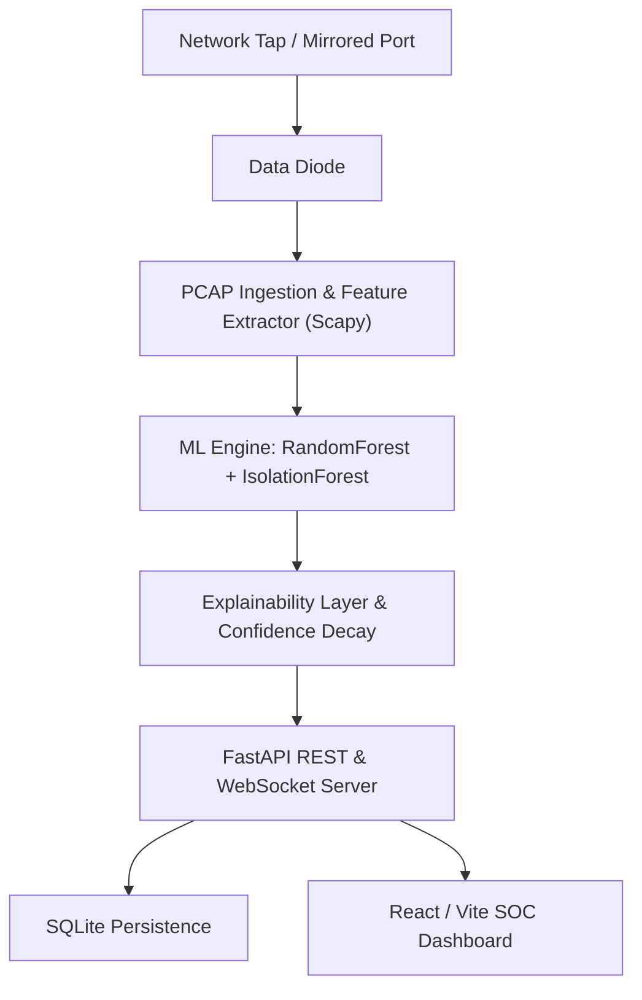

# SIH26145 — AI-Based Detection of Cyber Threats in Unidirectional IP Traffic

**Problem Statement:** SIH26145 (NTRO) — Smart India Hackathon 2026
**Category:** Software | **Theme:** Blockchain & Cybersecurity

An AI-driven threat detection system for unidirectional (one-way, passive-tap
style) network traffic monitoring. Detects DDoS, Data Exfiltration, and
Unauthorized Tunneling patterns in real time, with an explainability layer
and confidence-decay mechanism to reduce false positives over time.

## Architecture



## Architecture Rationale (Technical Approach)
The ML pipeline utilizes a deliberate hybrid ensemble:
- **Random Forest (Supervised):** Handles the high-precision classification of known threat vectors (DDoS, Exfiltration, Tunneling). Random Forest was chosen because it creates highly non-linear decision boundaries resilient to the missing data of unidirectional links, while remaining inherently interpretable (essential for the Explainability Layer).
- **Isolation Forest (Unsupervised):** Runs in parallel to catch zero-day deviations. If a novel tunneling method evades the Random Forest's training distribution, the Isolation Forest flags it purely based on its mathematical distance from the established benign baseline.

## Prior Art & Differentiation (Novelty)
Standard Intrusion Detection Systems (like Snort, Suricata, or academic models trained blindly on the CICIDS datasets) implicitly rely on **bidirectional flow states**. They look for incomplete SYN-ACK handshakes, bidirectional flow duration, or backward-packet payload sizes to confirm attacks. 
When placed behind a hardware data diode, these tools suffer catastrophic false-positive rates because *every* flow appears incomplete. 
**Our Differentiation:** Instead of fighting the lack of return traffic, our model exploits it. We engineered novel features—specifically `ack_completeness_ratio` and `retransmission_blindness_index`—that use the strict *absence* of adaptive protocol backoff as a primary mathematical signal. This paradigm shift allows the model to differentiate between a severed benign flow and a malicious blind tunnel, which off-the-shelf IDS software cannot do.

## Repository structure

SAH26/
├── backend/
│ ├── main.py # FastAPI entrypoint, CORS, WebSocket routing
│ ├── requirements.txt
│ ├── api/v1/routes/
│ │ ├── traffic.py # historical logs, threat stats
│ │ └── alerts.py # alert management/filtering
│ ├── services/
│ │ ├── ml_engine.py # loads trained model, runs inference
│ │ └── websocket_manager.py # synthetic traffic generator + broadcast
│ ├── scripts/
│ │ ├── train_model.py # generates dataset, trains models
│ │ └── evaluate_model.py # precision/recall/F1/confusion matrix
│ └── models/
│ ├── schemas.py # Pydantic models
│ └── trained/ # .pkl model files (gitignored)
├── frontend/
│ ├── src/
│ │ ├── App.tsx
│ │ ├── hooks/useWebSocket.ts
│ │ └── components/
│ │ ├── Dashboard.tsx
│ │ ├── LiveTrafficTable.tsx
│ │ ├── AnalyticsCharts.tsx
│ │ └── AIExplanationPanel.tsx
│ ├── package.json
│ └── tailwind.config.js
├── docs/
│ ├── feasibility.md
│ ├── impact.md
│ ├── model_performance.md
│ └── pitch-deck-outline.md
├── .gitignore
└── README.md

## What's implemented

- Real trained ML pipeline (RandomForest + IsolationForest) on a unidirectional-simulated sample of the CSE-CIC-IDS2018 dataset — no synthetic generation or rule-based mocks
- Explainability layer generating plain-language reasons and SHAP-style contributions for each alert
- Confidence-decay logic to dampen repeated benign anomalies over time
- PCAP Ingestion Endpoint via `scapy` for real packet analysis
- SQLite persistence layer for alert history
- FastAPI backend with REST endpoints + live WebSocket alert streaming
- React dashboard: live traffic table, Severity-based alerts, historical DB load, and simulated attack injections
- Model evaluation report with real precision/recall/F1/confusion matrix rendered in UI

## What's NOT implemented yet

- Full JWT-backed Backend Authentication (Role-based access is currently mocked in UI for demo purposes)
- Production-scale throughput benchmarking beyond estimates in `docs/feasibility.md` (Would require Kafka ingestion queue instead of direct FastAPI processing)

## How to run locally

### Backend

```bash
cd backend
python -m venv venv
source venv/bin/activate        # Windows: venv\Scripts\activate
pip install -r requirements.txt

# train the model (only needed once, or to retrain)
python scripts/train_model.py

# evaluate the model (optional, prints/saves metrics)
python scripts/evaluate_model.py

# run the API server
uvicorn main:app --reload
```

Backend runs at `http://localhost:8000`. Interactive API docs available at
`http://localhost:8000/docs`.

### Frontend

```bash
cd frontend
npm install
npm run dev
```

Frontend runs at `http://localhost:5173`. Requires **Node.js v18+**.

Once both are running, open the frontend in your browser and start the
traffic replay to see live alerts populate the dashboard.

## Documentation

- [`docs/feasibility.md`](docs/feasibility.md) — deployment feasibility on
  data-diode infrastructure, throughput estimates, Kafka scaling path
- [`docs/impact.md`](docs/impact.md) — target users, SOC analyst time
  savings, scalability reasoning
- [`docs/model_performance.md`](docs/model_performance.md) — real evaluated
  precision/recall/F1 and confusion matrix
- [`docs/pitch-deck-outline.md`](docs/pitch-deck-outline.md) — slide-ready
  outline matching SIH's standard PPT format

