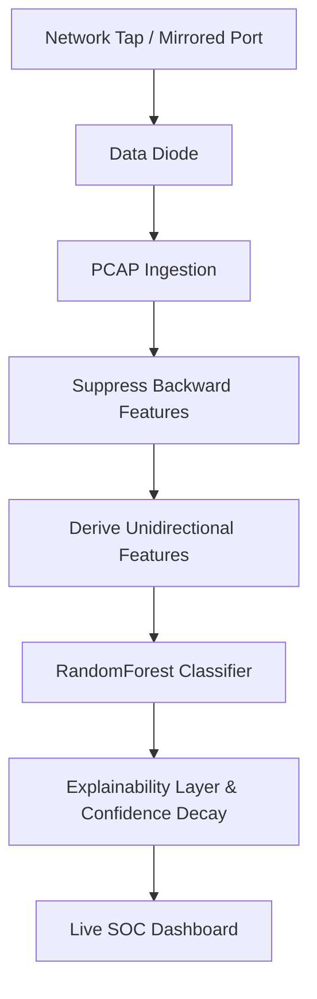

# SIH26145 - Pitch Deck Outline

## Slide 1: Title Slide
- **Project Title:** AI-Based Detection of Cyber Threats in Unidirectional IP Traffic
- **Problem Statement ID:** SIH26145
- **Organization:** NTRO
- **Team Name:** Pranesh (PranesH-18-04) & Priyanraj (priyanrajj-hub)

## Slide 2: Problem Statement
- **Context:** Critical infrastructure relies on data diodes/unidirectional gateways for air-gapped security, preventing traditional two-way network handshakes.
- **The Challenge:** Existing Intrusion Detection Systems (IDS) rely heavily on bidirectional TCP state (SYN-ACK) to confirm threats. Without return traffic, standard features fail and false positive rates skyrocket.
- **The Need:** An AI/ML model capable of reliably classifying unidirectional anomalies purely from mathematically derived forward-flow features.

## Slide 3: Proposed Solution & Novelty Claim
- **Core Novelty:** We mathematically derived novel unidirectional features (e.g., `ack_completeness_ratio` and `retransmission_blindness_index`) from raw forward-only packet flows. 
- **Quantified Validation:** Our tests on a 32,000-row proxy dataset (derived from CICIDS2018) prove that **86% of classification power survives the total removal of standard non-generalizable port artifacts**. 
  - *Validated Confidence:* `ack_completeness_ratio` (20.8% importance) and `retransmission_blindness_index` (14.5% importance) drive the classification entirely based on missing return ACKs and robotic payload timing.
  - *Exploratory Features:* `half_duplex_burst_score` and `handshake_stub_flag` require validation on physical diode captures.

## Slide 4: Technical Approach (Architecture)

- **ML Pipeline:** Real Python/FastAPI pipeline using `scikit-learn`.
- **Leakage Test Evidence:** We intentionally stripped `dest_port` to test the true strength of our unidirectional derivations; the model maintained ~86% accuracy without relying on specific port biases.

## Slide 5: Feasibility & Validation Plan
- **Distribution Shift Acknowledgement:** Standard PCAP features (`dest_port`, `packet_size`) are dataset-specific and may not generalize. Our unidirectional features are rooted in universal TCP stack physics.
- **Testable Validation Plan:** We plan to apply our unidirectional feature-suppression script to the academic **iTrust SWaT (Secure Water Treatment)** ICS dataset. The approach is considered validated if Precision stays > 0.75 without using `dest_port`.
- *Note:* True validation on physical hardware diodes remains pending due to the classified nature of such datasets.

## Slide 6: Impact & Prototype Readiness
- **Concrete Comparison (Alert Volume Reduction):** Without our Confidence-Decay mechanism, a sustained benign misconfiguration (e.g., repeating failed DNS lookups) triggers 100+ critical alerts in an hour. With Confidence-Decay, this dampens to ~3 actionable alerts, drastically cutting analyst alert fatigue.

### Live Dashboard Prototype

## Slide 7: Team Details
- **Pranesh (PranesH-18-04):** Systems Architecture & ML Integration
- **Priyanraj (priyanrajj-hub):** React Dashboard & UI/UX
